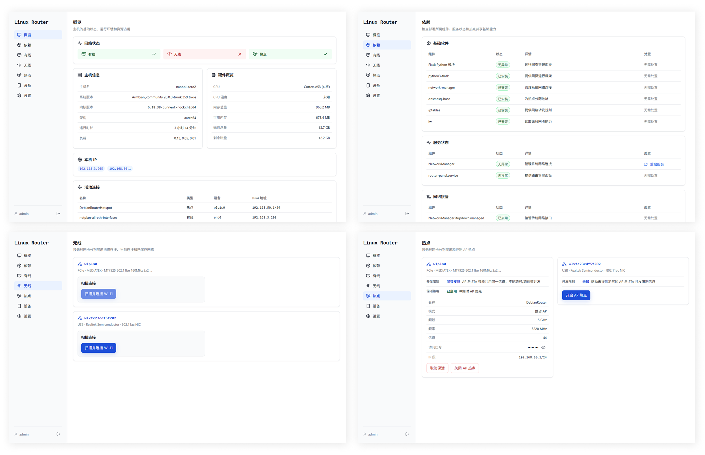

[English](README.md) | [简体中文](README.zh-CN.md)

# Linux Router

## Introduction

Linux Router turns a Debian/Armbian device into a router. It provides a Web interface for managing system status, network configuration, Wi-Fi, hotspot sharing, and connected clients.

The project is built with Flask, NetworkManager, and systemd. System queries and network changes are handled by a dedicated root Agent.



## Features

- View system information, network interfaces, IP addresses, and active connections
- Check and repair runtime dependencies and the NetworkManager environment
- Manage wired and Wi-Fi connections, including scanning, connecting, disconnecting, and forgetting networks
- Create exclusive AP or concurrent AP+STA hotspots
- View hotspot clients, DHCP leases, and wireless connection status
- Configure the hotspot LAN subnet and NetworkManager shared mode
- Enable hotspot keepalive and automatic recovery after disconnection
- Change the administrator password and reboot the device

## Network Change Risks

Initial installation, uninstallation, and network-stack repair modify the host network configuration. These operations may reload NetworkManager, apply netplan, start or stop `dhcpcd`, and remove project hotspot connections or wireless virtual interfaces. Network connectivity may be interrupted.

Run installation and uninstallation from a local console or during a maintenance window, and back up the host network configuration first. Over SSH, network changes that could interrupt the current connection are deferred by default. Use `--apply-network-now` when they must be applied immediately.

Installation options:

```bash
# Skip writing and applying the project's NetworkManager/netplan configuration
sudo bash /tmp/linux-router-install.sh install --no-network-config

# Write network configuration without applying it immediately
sudo bash /tmp/linux-router-install.sh install --defer-network-restart
```

`--no-network-config` still enables NetworkManager and IPv4 forwarding; it only skips writing and applying the project's NetworkManager/netplan configuration. During deferred uninstallation, runtime network state is not restored immediately. Re-run uninstallation with `--apply-network-now` during a maintenance window. Deferred mode cannot be combined with `--purge-data`.

## Requirements

The target system should be Debian 13 or Debian-based Armbian with systemd, apt, and NetworkManager. Network interfaces are managed by NetworkManager.

The installer installs or checks the following main dependencies:

- Python 3, Flask, and Gunicorn
- NetworkManager
- dnsmasq-base
- iptables
- iw
- iproute2, udev, curl, and tar

The installer downloads the source archive from GitHub. Git is not required on the target device.

## Install, Upgrade, and Uninstall

### Install

Download the installer and perform a new installation:

```bash
curl -fsSL https://raw.githubusercontent.com/Jaksay/Linux-Router/main/install.sh \
  -o /tmp/linux-router-install.sh
sudo bash /tmp/linux-router-install.sh install
```

The installer installs dependencies, deploys the application, creates the `router-panel` service account, generates the initial administrator password, installs both systemd services, and configures IPv4 forwarding and the NetworkManager network stack.

Default locations:

- Application: `/opt/linux-router`
- Data: `/var/lib/linux-router`
- Web service: `router-panel.service`
- Root Agent: `router-panel-agent.service`

### Upgrade

```bash
sudo bash /tmp/linux-router-install.sh upgrade
```

An upgrade replaces only the application files and systemd service definitions. It preserves administrator credentials, keys, the LAN subnet, and other runtime data. It does not reconfigure NetworkManager, netplan, IPv4 forwarding, or `dhcpcd`. A health check runs after the upgrade; the previous version is restored if the check fails.

### Uninstall

The default uninstall removes the application, systemd services, and runtime socket. It also attempts to remove the `DebianRouterHotspot` connection and wireless virtual interfaces matching `ap-*`, then restores the NetworkManager, netplan, IPv4 forwarding, and `dhcpcd` states saved before installation. Administrator credentials, keys, and LAN configuration are preserved for a future reinstallation.

```bash
sudo bash /tmp/linux-router-install.sh uninstall
```

To remove all runtime data, explicitly add `--purge-data`. This operation is irreversible:

```bash
sudo bash /tmp/linux-router-install.sh uninstall --purge-data
```

## Architecture

The project uses two systemd services: a Web service running as the unprivileged `router-panel` user and a root Agent. The Web service handles pages, login, and operation submission. The Agent exposes allowlisted system queries and network changes through a Unix socket.

Network changes are executed serially by the Agent. The Web interface queries the operation result and refreshes the relevant status.

## First Login

The installer creates the administrator account:

- Username: `admin`
- Password: generated during installation and printed when installation completes

The initial password is also saved to:

```text
/var/lib/linux-router/initial_password.txt
```

Change the password immediately after the first login. Password hashes, the Flask secret key, LAN configuration, and hotspot keepalive configuration are stored in the data directory and must not be committed to Git.

## Development

Start the root Agent before starting the Web service:

```bash
cd /opt/linux-router

# Terminal 1
sudo env \
  LINUX_ROUTER_DATA_DIR=/var/lib/linux-router \
  LINUX_ROUTER_AGENT_SOCKET=/run/linux-router/agent.sock \
  python3 agent.py

# Terminal 2
python3 app.py
```

The default listening addresses are `http://127.0.0.1:80` and `http://<device-ip>:80`. Production deployments should use the Gunicorn systemd service provided by the project.

After code changes:

- Web code or templates: restart `router-panel.service`;
- Agent, system queries, or network operations: restart `router-panel-agent.service`;
- `static/style.css`: also increment the CSS URL `v` parameter in `templates/base.html`.

Run tests:

```bash
python3 -m unittest tests.test_application
```

See [DEPLOYMENT.md](DEPLOYMENT.md) for detailed manual deployment and troubleshooting instructions.
